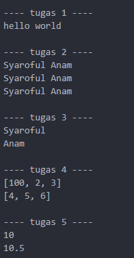
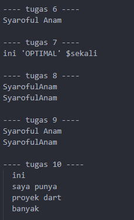

# Laporan Tugas KUIS
---
## Mauhamad Syaroful Anam | TI-3G | 2141720108
---
<<<<<<< HEAD
## Output Program Dart
 
### Tugas 1
- Output: `hello world`
- Penjelasan: Program mencetak "hello world" ke layar.

### Tugas 2
- Output:
=======
### Soal 1
>>>>>>> 84ff7f6a5dd5e26d94d66917858e37b855ab449b
```
Syaroful Anam
Syaroful Anam
Syaroful Anam
```
- Penjelasan: Variabel `name` berisi string "Syaroful Anam", dan kemudian dicetak tiga kali.

### Tugas 3
- Output:
```
Syaroful
Anam
```
- Penjelasan: Variabel `firstName` dan `lastName` masing-masing berisi "Syaroful" dan "Anam", dan keduanya dicetak secara terpisah.

### Tugas 4
- Output:
  ```
  [100, 2, 3]
    [4, 5, 6]
  ```
- Penjelasan: `array1` adalah variabel yang bisa diubah (mutable), sehingga elemennya dapat diubah. Namun, `array2` adalah variabel konstan (constant), sehingga tidak dapat diubah setelah inisialisasi.

### Tugas 5
- Output:
```
10
10.5
```
- Penjelasan: Variabel `number` pertama-tama berisi angka bulat (num), kemudian diubah menjadi angka desimal (double), menunjukkan fleksibilitas dalam Dart untuk mengubah tipe variabel.

### Tugas 6
- Output: `Syaroful Anam`
- Penjelasan: Variabel `fullName` menggabungkan `firstName1` dan `lastName1`, dan hasilnya dicetak sebagai satu string.

### Tugas 7
- Output: `ini 'OPTIMAL' $sekali`
- Penjelasan: Variabel `text` berisi string dengan karakter khusus seperti tanda kutip tunggal dan dolar, yang dipreservasi karena digunakan tanda kutip ganda.

### Tugas 8
- Output:
```
SyarofulAnam
SyarofulAnam
```
- Penjelasan: `name1` menggabungkan `firstName` dan `lastName` dengan menggunakan operator `+`. `name2` menggabungkan keduanya tanpa operator tambahan.

### Tugas 9
- Output:
```
Syaroful Anam
SyarofulAnam
```
- Penjelasan: `name3` menggabungkan `firstName` dan `lastName` dengan spasi di antaranya. `name4` menggabungkan keduanya tanpa spasi.

### Tugas 10
- Output:
```
ini
saya punya
proyek dart
banyak
```
- Penjelasan: Variabel `kalimatPanjang` adalah string multi-baris yang mencakup beberapa baris teks.

### Perbedaan Penggunaan Tipe Variabel
- `var`: Digunakan untuk deklarasi variabel dengan inferensi tipe. Dart akan secara otomatis menentukan tipe variabel berdasarkan nilai yang diberikan.
- `final`: Digunakan untuk deklarasi variabel yang nilainya tetap setelah diinisialisasi. Nilai variabel final hanya dapat diatur sekali.
- `const`: Digunakan untuk deklarasi variabel yang nilainya konstan dan harus dikenal pada saat kompilasi. Nilai variabel const harus diketahui pada saat kompilasi dan tidak dapat diubah.


