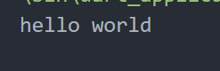
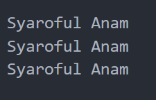
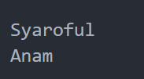
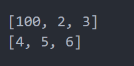
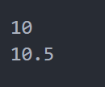
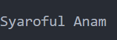
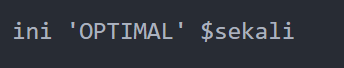
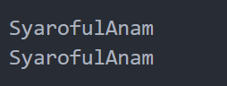
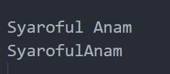
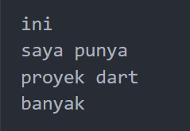

# Laporan Tugas KUIS

### Soal 1
```
  print('hello world');
```

### Soal 2
```
  String name = 'Syaroful Anam';

  print(name);
  print(name);
  print(name);
```

### Soal 3
```
  String firstName = 'Syaroful';
  String lastName = 'Anam';

  print(firstName);
  print(lastName);
```

### Soal 4
```
  final array1 = [1, 2, 3];
  const array2 = [4, 5, 6];

  array1[0] = 100;

  print(array1);
  print(array2);
```

### Soal 5
```
  num number = 10;
  print(number);

  number = 10.5;
  print(number);

```

### Soal 6
```
  String firstName1 = 'Syaroful';
  String lastName1 = 'Anam';

  var fullName = '$firstName1 $lastName1';
  print(fullName);
```

### Soal 7
```
  var text = 'ini \'OPTIMAL\' \$sekali';
  print(text);
```

### Soal 8
```
  var name1 = firstName + lastName;
  var name2 = 'Syaroful' 'Anam';
  print(name1);
  print(name2);
```

### Soal 9
```
  var name3 = "$firstName $lastName";
  var name4 = 'Syaroful' 'Anam';
  print(name3);
  print(name4);
```

### Soal 10
```
  var kalimatPanjang = '''
  ini
  saya punya
  proyek dart
  banyak ''';
  print(kalimatPanjang);
```

